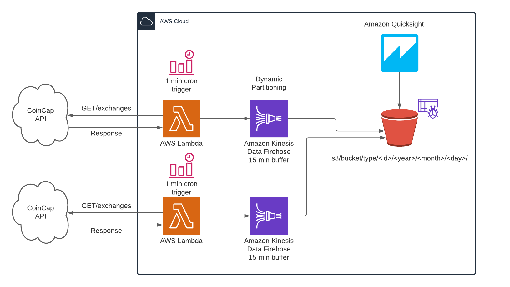

# 🧪 Projects

## [CoinCap data collection](https://github.com/trygvizl/CoinCap-firehose-s3-DynamicPartitioning) 🔗
This project was to try out the dynamic partitioning feature in AWS Kinesis Firehose that was, at the time, recently released. The project consists of a two Lambda functions fetching data from the public CoinCap APIs and then pushing the response to Kinesis. With Dynamic Partitioning enabled, Firehose will partition the data on S3 based on a specific value in the JSON object. To make it visual, I added a crawler to crawl s3 and the built a small Amazon Quicksight dashboard to visualize the data. 
- Technologies: Typescript, AWS Lambda, Kinesis Firehose, S3, Glue, Quicksight

